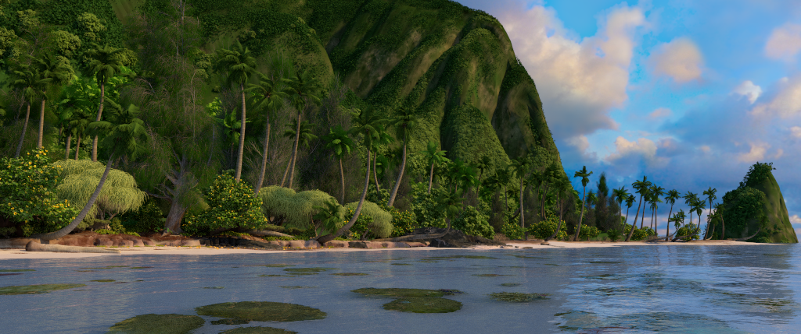
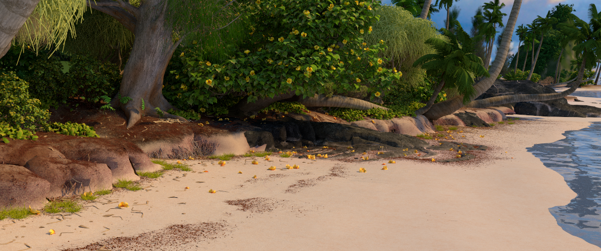
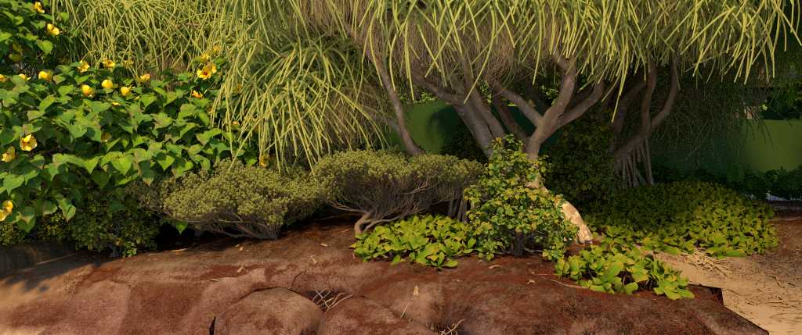
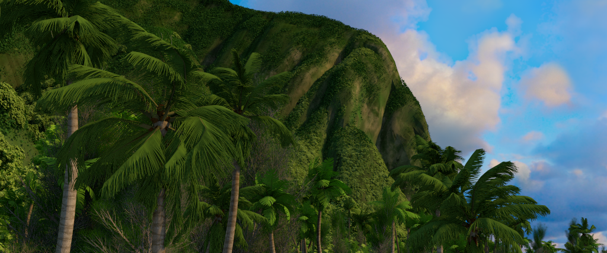
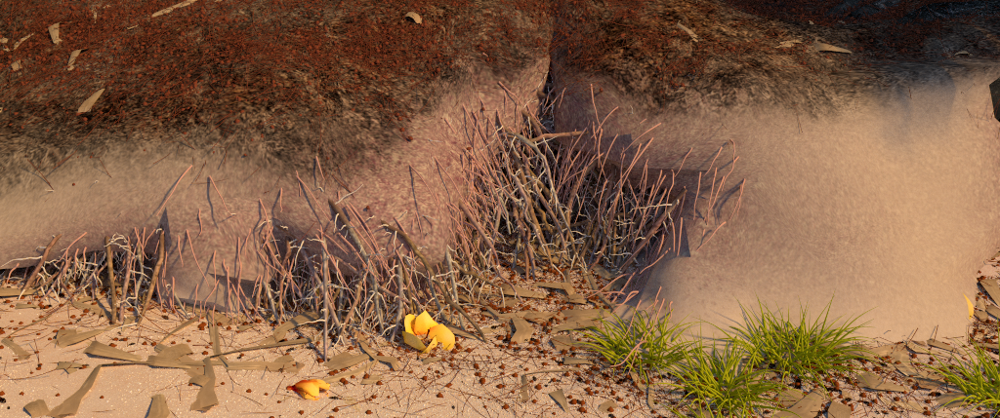
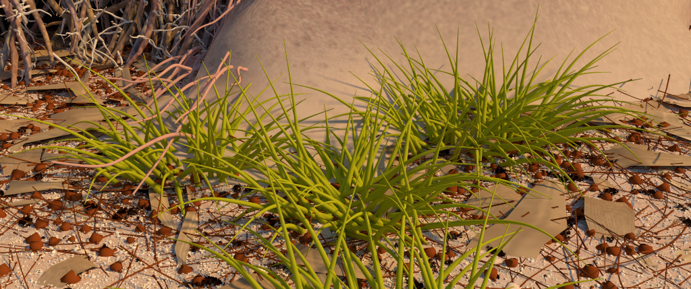

# GPU-Motunui

GPU-Motunui is a forward path tracer that renders Disney Animation's [Moana island scene](https://technology.disneyanimation.com/islandscene/). Using the OptiX 7 API and a custom out-of-core rendering solution, all ray tracing is done on the GPU. Read an introduction [here](https://www.render-blog.com/2020/10/03/gpu-motunui/).

## Renders
**shotCam:**


**beachCam:**


**dunesACam:**


**palmsCam:**


**rootsCam:**


**grassCam:**


## Build instructions
```
git clone --recursive https://github.com/chellmuth/gpu-motunui.git
cd gpu-motunui

# Pre-process the assets
cd scripts
export MOANA_ROOT=/path/to/moana/dataset
python moana.py
cd ..

# Build and run the renderer
mkdir build
cd build
export OPTIX_INSTALL_DIR=/path/to/optix
cmake -DCMAKE_BUILD_TYPE=Release -DOptiX_INSTALL_DIR="${OPTIX_INSTALL_DIR}" -DMOANA_ROOT="${MOANA_ROOT}" ..
make
./app/moana
```
